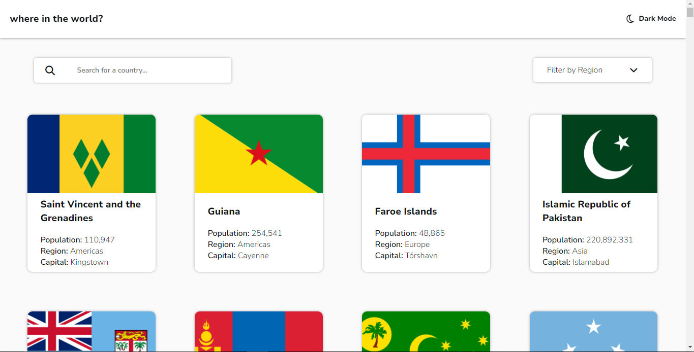
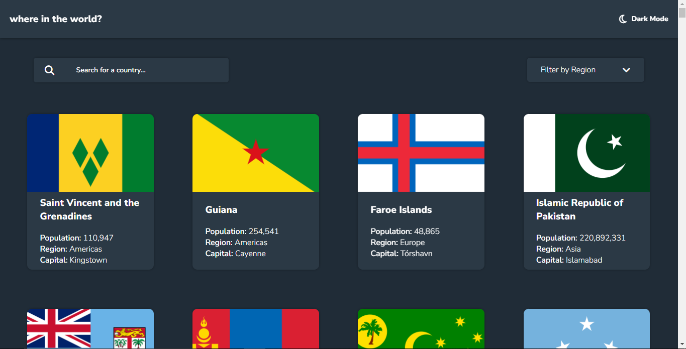

# Frontend Mentor - REST Countries API with color theme switcher solution

This is a solution to the [REST Countries API with color theme switcher challenge on Frontend Mentor](https://www.frontendmentor.io/challenges/rest-countries-api-with-color-theme-switcher-5cacc469fec04111f7b848ca). Frontend Mentor challenges help you improve your coding skills by building realistic projects. 

## Table of contents

  - [The challenge](#the-challenge)
  - [Screenshot](#screenshot)
  - [Links](#links)
  - [Built with](#built-with)
  - [What I learned](#what-i-learned)
  - [Continued development](#continued-development)
  - [Useful resources](#useful-resources)
- [Author](#author)

### The challenge

Users should be able to:

- See all countries from the API on the homepage
- Search for a country using an `input` field
- Filter countries by region
- Click on a country to see more detailed information on a separate page
- Click through to the border countries on the detail page
- Toggle the color scheme between light and dark mode *(optional)*

### Screenshot

### Links

- Solution URL: [here](https://github.com/Heliandro1/rest-countries-api-with-color-theme-switcher-master)
- Live Site URL: [here](https://rest-countries-api-one-nu.vercel.app/)

### Built with

- Semantic HTML5 markup
- CSS custom properties
- Flexbox
- CSS Grid
- Mobile-first workflow
- JavaScript

### What I learned

In this sensational project I learned about https request, APIs, and I could entirely integrate my front-end with an API

### Continued development

I will continue training about https request, API Rest, and AJAX to solidify my knowledgement about web development area.

### Useful resources

- [resource 1](https://restcountries.com/#api-endpoints-v3-all) - This helped me for http request and I could get informations about all countries. I really liked this pattern and will use it going forward.

## Author

- Frontend Mentor - [@heliandro1](https://www.frontendmentor.io/profile/heliandro1)
- Linkedin - [@adérito-caxala](https://www.linkedin.com/in/adérito-caxala)
- Instagram - [@heliandro_10](https://www.instagram.com/heliandro_10)
- Facebook - [@Heliandro](https://www.facebook.com/heliandro.1)